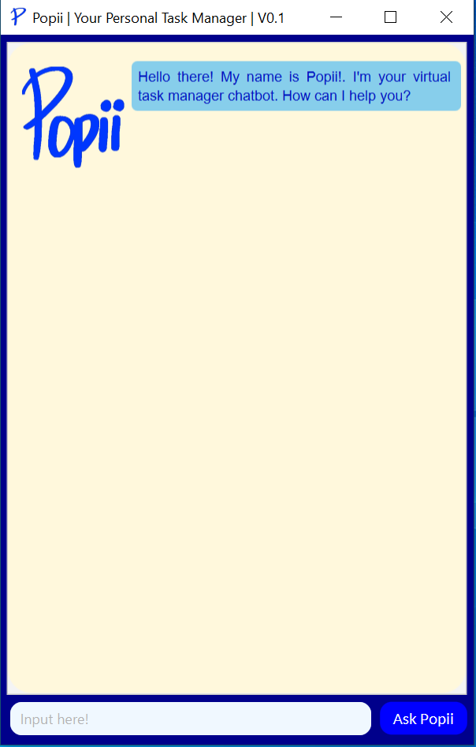

# User Guide
**Popii** is a desktop app for managing tasks such as todo, deadline, and events.
It is optimized for use via a Command Line Interface(CLI) while at the same
time still keeping the benefits of a Graphical User Interface (GUI). If you
like typing, Popii can get your task management done quicker than traditional
GUI apps.

- Getting started
- Features
  - Adding a task
    - Adding a todo: `todo`
    - Adding a deadline: `deadline`
    - Adding an event: `event`
  - Listing all tasks: `list`
  - Finding a task: `find`
  - Marking a task as done: `done`
  - Deleting a task: `delete`
  - Exiting the program: `bye`
  - Saving the data
- FAQ
- Command summary

## Getting started
1. Ensure that you have Java `11` or above installed in your PC.
2. Download the latest `popii.jar` from [here](https://github.com/michael-setia/ip/releases/tag/v0.1).
3. Copy the file to the folder that you want to use as the *home folder* for your Popii.
4. Double-click the file to start the app. The GUI similar to image below should appear in a few seconds.

5. Type the command in the *Input here!* box and press Enter or click the *Ask Popii* button.
   Some example commands you can try:
   - `todo read manga` : Adds a task with *read manga* as its description.
   - `list` : Displays all the tasks that you have in your list.
   - `done 1` : Marks task number 1 as done.
   - `find laundry` : Finds all tasks based on their description using the keyword *laundry*.
6. Refer to the Features below for more details of each command.

## Features 
Notes about the command format:
- Words in `UPPER_CASE` are the parameters to be supplied by the user.

## Adding a task
There are 3 types of task that can be added to the list:
- **todo** is a task that that has no exact timing.
- **deadline** is a task that must be done by a specific date.
- **event** is a task that must be done at certain date.

#### Adding a todo : `todo`
Adds a todo task to the list.

Format: `todo DESCRIPTION`

Examples:

- `todo do laundry`

- `todo watch episode 8 of NGE`

#### Adding a deadline : `deadline`

Adds a deadline task to the list.

Format: `deadline DESCRIPTION /by YYYY-MM-DD`

Examples:

- `deadline CS2105 assignment 1 /by 2020-09-10`

- `deadline submit CS2100 lab report 4 /by 2020-09-17`

#### Adding an event : `event`

Adds an event task to the list.

Format: `event DESCRIPTION /at YYYY-MM-DD`

Examples:

- `event project meeting /at 2020-09-19`

- `event programming workshop /at 2020-12-01`

### Listing all tasks : `list`

Displays all tasks in the list.

Format: `list`

- Each task has a number as an identifier.

- You can use this task number for other command.

### Finding a task : `find`

Finds all tasks that have description which contains the keyword as its prefix.

Format: `find KEYWORD`

- Only the first word of KEYWORD will be considered when searching for a particular task.

Examples:

- `find homework` displays a task with description "math homework 2".

- `find call` displays a task with description "call alice"

### Marking a task as done : `done`

Marks a task as done.

Format: `done TASK_NUMBER`

- Refer from the latest list to get the `TASK_NUMBER`.

- Task that is marked as done will have the symbol `V` when displayed.

Examples:

- `done 3` marks the 3rd task in the list as done.

- `done 5` marks the 5th task in the list as done.

### Deleting a task : `delete`

Deleting a task: `delete`

Format: `delete TASK_NUMBER`

- Refer from the latest list to get the `TASK_NUMBER`.

- Deleting a task will change the task number of all tasks that comes after the deleted task.

Examples:

- `delete 1` deletes the 1st task in the list.

- `delete 10` deletes the 10th task in the list.

### Exiting the program : `bye`

Exits the program and says bye to Popii.

Format: `bye`

### Saving the data

Popii automatically saves the list in the hard disk or solid state drive after any command that changes the 
data.

## FAQ

Q : Where is the list stored?

A : Popii stores the list in a file named `tasks.txt` under the folder `data`.

Q : Where is the `data` folder?

A : It should be under the home folder that you choose to place the .jar file i.e. it should be in the same directory as the .jar file.

Q : Can I edit the `tasks.txt` file?

A : You can edit it as long you understand the format. However, it is not recommended since one little mistake can cause error to the program.

Q : How do I transfer my data to other PC?

A : Move the folder `data` to the new PC and place it in the same directory as the .jar file.

## Command Summary
Command | Format | Examples
------- | ------ | --------
`todo` | `todo DESCRIPTION` | `todo read chapter 7`
`deadline` | `deadline DESCRIPTION /by YYYY-MM-DD` | `deadline team project /by 2020-11-15`
`event` | `event DESCRIPTION /at YYYY-MM-DD` | `event episode 11 discussion /at 2021-01-02`
`list` | `list`
`find` | `find KEYWORD` | `find cook`
`done` | `done TASK_NUMBER` | `done 12`
`delete` | `delete TASK_NUMBER` | `delete 3`
`bye` | `bye` |